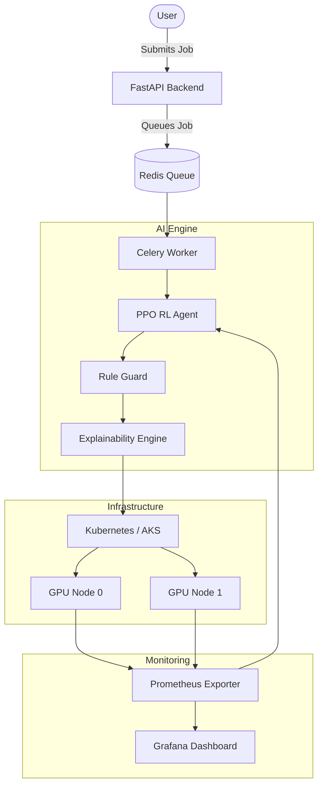
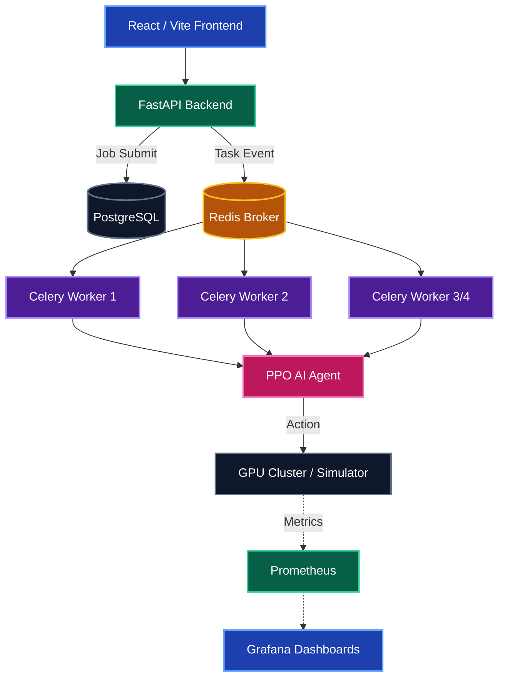

# SmartGPU Orchestrator

SmartGPU Orchestrator is a cloud-based AI infrastructure platform designed to intelligently allocate GPU resources to AI training workloads. By leveraging a trained Reinforcement Learning (RL) agent, the system optimizes scheduling decisions to maximize resource utilization and minimize costs, making every allocation explainable and self-improving.

**Note: This is an ongoing research project exploring the application of reinforcement learning in cloud infrastructure orchestration.**

## Architecture

The system operates across a five-stage pipeline:
1. User submission via the dashboard.
2. FastAPI validates and queues the job in Redis.
3. The PPO Reinforcement Learning Agent scores all available GPUs based on live telemetry (utilization, free memory, temperature).
4. The Explainability Engine generates human-readable reasoning for the assignment, estimating cost savings.
5. Kubernetes schedules the Docker container, while Prometheus and Grafana track the live metrics.

## Key Features

- **AI-Driven Scheduling**: Replaces static heuristics with a Proximal Policy Optimization (PPO) reinforcement learning agent.
- **Explainability**: Provides human-readable reasoning per scheduling decision, ensuring the AI model is transparent.
- **Self-Improving**: Automatically logs experiences and retrains the model continuously.
- **Cost Tracking**: Computes predicted cost versus a round-robin baseline to measure actual financial impact.
- **Hybrid Safety Layer**: Includes a hard rule guard to prevent Out-Of-Memory (OOM) errors and thermal throttling, overriding the AI when necessary.

## Technology Stack

- **Frontend**: React, Vite, Recharts
- **Backend**: FastAPI, Python, Redis, Celery, PostgreSQL
- **AI Engine**: Stable-Baselines3 (PPO)
- **Infrastructure**: Docker, Kubernetes (Azure AKS)
- **Monitoring**: Prometheus, Grafana

## References

For detailed methodology, architecture analysis, and competitive landscape comparisons, please refer to the primary project documentation included in this repository:
- `Full report.md`
- `SmartGPU_Report.docx`
- `SMARTGPU_COMPLETE_CODE.md`

This research demonstrates that intelligent scheduling directly reduces GPU waste, prevents OOM-caused job failures, and significantly lowers computational costs compared to naive static schedulers.

---

## Deep Dive: System Architecture & RL Engine

### 1. The Core Idea & Use Cases

#### The Problem
In traditional high-performance computing (HPC) environments or AI labs, GPU jobs are usually scheduled using simple methods like "Round Robin" (distribute evenly) or "Bin Packing" (cram as much into one GPU as possible). These naive approaches ignore dynamic, real-world factors:
- **Thermal Throttling**: A GPU at 95°C will slow down, ruining job performance.
- **Memory Spikes**: Cramming jobs can trigger sudden Out-Of-Memory (OOM) crashes.
- **Queue Buildup**: A GPU might have memory available but have 5 jobs waiting in line, causing massive latency.

#### The SmartGPU Solution
SmartGPU uses a **Reinforcement Learning (RL) Agent** that observes the live state of the cluster (Utilization, Memory, Temperature, Queue Depth). The agent is rewarded for placing jobs on cool, available GPUs and heavily penalized if its decisions result in overheating, saturation, or Out-Of-Memory errors. Over time, the agent learns a highly nuanced, non-linear scheduling policy that outperforms human-coded heuristics.

#### Where is it used?
- **AI Research Labs**: Managing access to shared DGX or on-premise clusters.
- **Cloud Providers**: Maximizing the density of virtualized GPU instances.
- **Enterprise MLOps**: Orchestrating massive, automated ML training pipelines where hardware efficiency directly translates to cost savings.

### 2. Distributed Microservices Architecture

**Component Breakdown:**
1. **Frontend (React/Vite)**: The beautiful dark-mode UI where users monitor the cluster and submit AI training jobs.
2. **Backend API (FastAPI)**: The central brain that receives REST requests and manages the PostgreSQL database.
3. **Task Queue (Redis + Celery)**: Ensures jobs are processed asynchronously. When a job arrives, a Celery worker picks it up and asks the RL agent where to place it.
4. **Database (PostgreSQL)**: Stores job history, costs, and decisions.
5. **Monitoring (Prometheus + Grafana)**: Scrapes the live cluster to provide beautiful real-time charts of temperature, memory, and utilization.

### 3. The AI Brain: Proximal Policy Optimization (PPO)

At the heart of the orchestrator is the **Decision Engine**, powered by **Proximal Policy Optimization (PPO)** using the `stable_baselines3` library. 

**Why PPO?**
We chose PPO because it is the industry standard for production RL applications (it's the same algorithm OpenAI uses to train ChatGPT). 
- **Continuous Observations**: It perfectly handles continuous floats (e.g., Temperature = 65.4°C).
- **Discrete Actions**: It perfectly handles discrete outputs (e.g., Action = Pick GPU 2).
- **High Stability**: Unlike older algorithms (like A2C or DQN), PPO prevents the agent from making massive, destructive updates to its brain in a single step, making training highly stable.

**How it Works (The RL Loop)**
1. **Observe**: The agent looks at the current `State` (Memory, Temp, Util, Queue for all 4 GPUs).
2. **Act**: The agent selects an `Action` (e.g., "Assign to GPU 1").
3. **Reward/Penalty**: The environment calculates the result. If GPU 1 was idle, it gets `+1.5` reward. If GPU 1 was full and triggered an OOM error, it gets a `-2.0` penalty.
4. **Learn**: The agent adjusts its internal neural network to avoid that mistake in the future.

> **Note on Lazy Loading:**
> The PPO `.zip` model is roughly several megabytes in size. To keep memory usage low, Celery workers only load the model into memory the exact moment the very first AI job needs to be scheduled.

### 4. Engineering the Reward System (Bias Fixes)

Training an RL agent is notoriously difficult. During our development, the agent experienced "Policy Collapse" (it learned to either always pick GPU-0, or became completely paralyzed). We implemented several critical architectural fixes to solve this:

1. **Unified Reward Scaling:** Initially, penalties for heat and queues were massively out of scale (e.g., `-50` penalty for a minor queue). This drowned out the positive signals. We normalized all rewards to exist in a tight `[-2.0, +2.0]` boundary so the neural network could easily parse them.
2. **The Memory Leak Fix (Realistic Simulation):** Our training simulator had a bug where jobs were assigned to GPUs but never simulated as finishing. Within 5 steps, the entire cluster would run out of memory, and the agent would receive a `-2.0` OOM penalty for the remaining 195 steps of the episode. We fixed this by tracking active jobs and releasing memory dynamically, allowing the agent to learn true long-term strategies.
3. **Load Balancing Bonus & Entropy:** We added a `+0.5` bonus whenever the agent picks the objectively least-loaded GPU. We also adjusted the `ent_coef` (Entropy Coefficient) to `0.01` in PPO. This injects a small amount of randomness into the agent's brain during training, forcing it to explore all 4 GPUs rather than getting lazy and exclusively using GPU 0.
4. **Observation Clamping:** We used `np.clip()` to force all environment observations between `[0, 1]`. This prevents transient hardware bugs (like a broken sensor returning `999°C`) from destroying the agent's mathematical gradients.
